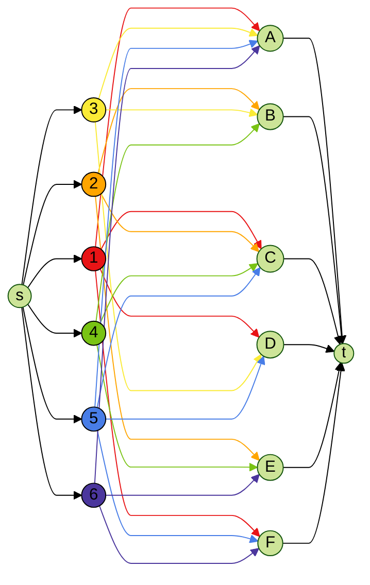
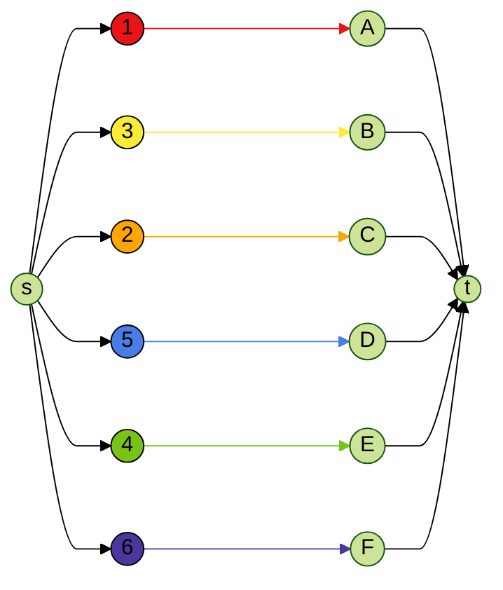
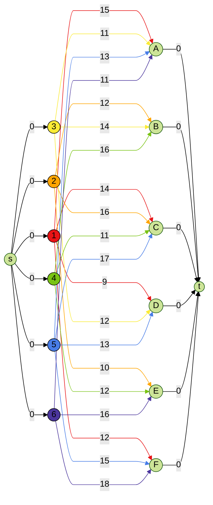

# Modelowanie Matematyczne - Projekt 1

```
Bartłomiej Krawczyk, 310774
```

## Zadanie 1 - Sieć przepływowa

W centrum dyspozytorskim planuje się dostawy węgla z określonych kopalń do elektrowni.
Rozważana jest możliwość dostaw węgla kamiennego z trzech kopalń A, B, C do trzech elektrowni
F, G, H za pomocą sieci kolejowej z dwoma stacjami pośrednimi D i E.

- Jednostkowe koszty transportowe i przepustowości na poszczególnych odcinkach wynoszą (skierowanie łuku jest od wiersza do kolumny):
    - koszt:

    |   | D | E | F | G | H |
    |---|---|---|---|---|---|
    | A | 3 | 6 | - | - | - |
    | B | 6 | 3 | - | - | - |
    | C | 4 | 5 | - | - | - |
    | D | - | 2 | 5 | 7 | 3 |
    | E | - | - | 5 | 4 | 2 |

    - przepustowość:

    |   | D  | E  | F  | G | H  |
    |---|----|----|----|---|----|
    | A | 8  | 10 | -  | - | -  |
    | B | 10 | 13 | -  | - | -  |
    | C | 10 | 8  | -  | - | -  |
    | D | -  | 20 | 16 | 6 | 10 |
    | E | -  | -  | 7  | 4 | 2  |

- Zdolności wydobywcze kopalń wynoszą (w tys. ton): $W_A = 10, W_B = 13, W_C = 22$.
- Średnie zużycie dobowe węgla przez elektrownie wynosi (w tys. ton): $Z_F = 15, Z_G = 10, Z_H = 10$.

Zadanie polega na wyznaczeniu planu codziennych dostaw węgla zaspokajający zapotrzebowania
elektrowni i minimalizujący sumaryczne koszty transportu. W tym celu należy:
- sformułować i narysować model sieciowy (sieć przepływową); Określić jaki problem na tej
sieci należy rozwiązać (należy nazwać problem do rozwiązania, nie algorytm)
- znaleźć jak najlepsze rozwiązanie (dowolną metodą ręcznie lub algorytmicznie)
- zapisać odpowiadające zadanie programowania liniowego

Ponadto, należy sprawdzić, gdzie w sieci transportowej występuje wąskie gardło, które stanowiłoby
ograniczenie w przypadku zwiększonego zapotrzebowania ze strony elektrowni (koszty transportu
należy pominąć). W tym celu należy znaleźć przekrój o jak najmniejszej przepustowości; jaką
informację niesie przepustowość wybranego przekroju?

---

> Sformułować i narysować model sieciowy (sieć przepływową); Określić jaki problem na tej sieci należy rozwiązać

Problemem, który należy rozwiązać jest **problem najtańszego przepływu**.

Zapotrzebowanie dobowe wszystkich elektrowni wynosi $F_{zadane} = Z_F + Z_G + Z_H = 35$, zatem zadany przepływ to $35$ jednostek (tys. ton).

Należy znaleźć przepływ ze źródła $s$ do ujścia $t$ o zadanej wielkości $F_{zadane}$ i minimalnym sumarycznym koszcie.


> Znaleźć jak najlepsze rozwiązanie.

Najlepsze rozwiązanie znalezione algorytmicznie prowadzi do kosztu równego **296**.

from \ to | s | A | B  | C  | D  | E | F | G | H | t
----------|---|---|----|----|----|---|---|---|---|---
s         | 0 | 8 | 13 | 14 | 0  | 0 | 0 | 0 | 0 | 0
A         | 0 | 0 | 0  | 0  | 8  | 0 | 0 | 0 | 0 | 0
B         | 0 | 0 | 0  | 0  | 4  | 9 | 0 | 0 | 0 | 0
C         | 0 | 0 | 0  | 0  | 10 | 4 | 0 | 0 | 0 | 0
D         | 0 | 0 | 0  | 0  | 0  | 0 | 8 | 6 | 8 | 0
E         | 0 | 0 | 0  | 0  | 0  | 0 | 7 | 4 | 2 | 0
F         | 0 | 0 | 0  | 0  | 0  | 0 | 0 | 0 | 0 | 15
G         | 0 | 0 | 0  | 0  | 0  | 0 | 0 | 0 | 0 | 10
H         | 0 | 0 | 0  | 0  | 0  | 0 | 0 | 0 | 0 | 10
t         | 0 | 0 | 0  | 0  | 0  | 0 | 0 | 0 | 0 | 0


> Zapisać odpowiadające zadanie programowania liniowego.

### Zbiory

- $V = \{s, A, B, C, D, E, F, G, H, t\}$ - zbiór wszystkich węzłów sieci przepływowej,
- $U = V \setminus \{s, t\}$ - zbiór węzłów sieci przepływowej z wyłączeniem źródła $s$ i ujścia $t$,
- $E \subset V \times V$ - zbiór łuków dostępnych w danej sieci przepływowej.

$$
V = \{s, A, B, C, D, E, F, G, H, t\}
$$
$$
U = \{A, B, C, D, E, F, G, H\}
$$
$$
E = \{
    (A, D), (A, E), \\
    (B, D), (B, E), \\
    (C, D), (C, E), \\
    (D, E), (D, F), (D, G), (D, H), \\
    (E, F), (E, G), (E, H)
\}
$$

### Parametry

- $F_{zadane} = 35$ - całkowite zapotrzebowanie dobowe węgla.
- $c_{uv}\ dla (u, v) \in E$ - przepustowość ustalona dla każdego łuku rozpoczynającego się w węźle $u$ i kończącego się w węźle $v$. W przypadku $(u, v) \notin E$ przyjmujemy $c_{uv} = 0$,
- $d_{uv}\ dla (u, v) \in E$ - koszt ustalony dla każdego łuku rozpoczynającego się w węźle $u$ i kończącego się w węźle $v$. W przypadku $(u, v) \notin E$ przyjmujemy $d_{uv} = 0$.

$$
c_{AD} = 8, c_{AE} = 10 \\
c_{BD} = 10, c_{BE} = 13 \\
c_{CD} = 10, c_{CE} = 8 \\
c_{DE} = 20, c_{DF} = 16, c_{DG} = 6, c_{DH} = 10 \\
c_{EF} = 7, c_{EG} = 4, c_{EH} = 2
$$
$$
c_{sA} = 10, c_{sB} = 13, c_{sC} = 22 \\
c_{Ft} = 15, c_{Gt} = 10, c_{Ht} = 10
$$

$$
d_{AD} = 3, d_{AE} = 6 \\
d_{BD} = 6, d_{BE} = 3 \\
d_{CD} = 4, d_{CE} = 5 \\
d_{DE} = 2, d_{DF} = 5, d_{DG} = 7, d_{DH} = 3 \\
d_{EF} = 5, d_{EG} = 4, d_{EH} = 2
$$

### Zmienne decyzyjne

- $f_{uv}\ dla (u, v) \in E$ - przepływ przez łuk rozpoczynający się w węźle $u$ i kończącego się w węźle $v$,
- $D$ - zmienna pomocnicza - całkowity koszt wszystkich przepływów.

### Funkcja oceny

- $min(D)$ - minimalizujemy całkowity koszt wszystkich przepływów.

### Ograniczenia

- Przepływ nie może być negatywny:
$$
f_{uv} \ge 0
$$

- Całkowity koszt jest sumą kosztu wszystkich przepływów:
$$
D = \sum_{(u, v) \in E} d_{uv} f_{uv}
$$

- Ze źródła $s$ wypływa $F_{zadane}$ jednostek:
$$
\sum_{z \in V} f_{sz} = F_{zadane}
$$

- Suma wpływających jednostek i wypływających z danego węzła powinna być równa (wyjątkiem jest źródło $s$ i ujście $t$):
$$
\forall{v \in U} : \sum_{z \in V} f_{vz} = \sum_{u \in V} f_{uv}
$$

- Przepływ przez dany łuk nie może przekroczyć maksymalnego przepływu:

$$
\forall{(u, v) \in E} : f_{uv} \le c_{uv}
$$

> Ponadto, należy sprawdzić, gdzie w sieci transportowej występuje wąskie gardło, które stanowiłoby
ograniczenie w przypadku zwiększonego zapotrzebowania ze strony elektrowni (koszty transportu
należy pominąć). W tym celu należy znaleźć przekrój o jak najmniejszej przepustowości; jaką
informację niesie przepustowość wybranego przekroju?

TODO

--- 

## Zadanie 2 - Zadanie przydziału

1. Planowanie realizacji portfela przy ograniczonych kompetencjach

Softwarehouse posiada portfel projektów oznaczonych 1-6 oraz zespoły programistyczne
oznaczone A-F. Poniża tabela przedstawia kompetencje zespołów, gdzie „-„ oznacza brak
kompetencji zespołu do realizacji danego projektu.

Kompetencje zespołów:

projekt \ zespół | A | B | C | D | E | F
-----------------|---|---|---|---|---|--
1                | X | - | X | X | - | X
2                | - | X | X | - | X | -
3                | X | X | - | X | - | -
4                | - | X | X | - | X | -
5                | X | - | X | X | - | X
6                | X | - | - | - | X | X

Należy dokonać przydziału zespołów programistycznych do poszczególnych projektów, przy
założeniu, że jeden zespół może realizować tylko jeden projekt, a jeden projekt może być
realizowany przez tylko jeden zespół. W tym celu:

- narysować model sieciowy problemu
- określić jaki problem należy rozwiązać i znaleźć ręcznie rozwiązanie
- na podstawie rozwiązania modelu sieciowego określić przydział zespołów do projektów

> narysować model sieciowy problemu



Każdy łuk ma maksymalną przepustowość równą **1**.

> określić jaki problem należy rozwiązać i znaleźć ręcznie rozwiązanie

Problem do rozwiązania w tym zadaniu to zadanie maksymalnego skojarzenia (przydziału).

- Przydzielamy projekty do zespołów
- Każdy projekt wymaga jednego zespołu
- Każdy zespół może realizować maksymalnie jeden projekt

Rozwiązanie znalezione ręcznie:

projekt \ zespół | A | B | C | D | E | F
-----------------|---|---|---|---|---|--
1                | X | - | - | - | - | -
2                | - | - | X | - | - | -
3                | - | X | - | - | - | -
4                | - | - | - | - | X | -
5                | - | - | - | X | - | -
6                | - | - | - | - | - | X




> na podstawie rozwiązania modelu sieciowego określić przydział zespołów do projektów

projekt | zespół
--------|-------
1       | A
2       | C
3       | B
4       | E
5       | D
6       | F

2. Minimalizacja kosztów realizacji projektów

Zakładamy, że firma wynajmuje zespoły do realizacji projektów. Koszty wynajmu są podane w
poniższej tabeli.

Koszty wykonywania projektów przez poszczególne zespoły:

projekt \ zespół | A  | B  | C  | D  | E  | F
-----------------|----|----|----|----|----|---
1                | 15 | -  | 14 | 9  | -  | 12
2                | -  | 12 | 16 | -  | 10 | -
3                | 11 | 14 | -  | 12 | -  | -
4                | -  | 16 | 11 | -  | 12 | -
5                | 13 | -  | 17 | 13 | -  | 15
6                | 11 | -  | -  | -  | 16 | 18

Należy dokonać przydziału zespołów programistycznych do projektów tak, aby
minimalizować koszty najmu zespołów. Ograniczenia dotyczące jednego zespołu i jednego
projektu pkt. 2.1 dalej obowiązują. W tym celu:
- narysować model sieciowy problemu
- określić jaki problem należy rozwiązać na tym modelu sieciowym
- spróbować znaleźć jak najlepsze rozwiązanie

> narysować model sieciowy problemu



Każdy łuk ma maksymalną przepustowość równą **1**.

> określić jaki problem należy rozwiązać na tym modelu sieciowym

Problemem do rozwiązania jest **zadanie najtańszego skojarzenia**.

- Przydzielamy projekty do zespołów
- Każdy projekt wymaga jednego z zespołów
- Każdy zespół może realizować tylko jeden projekt
- Trzeba zrealizować wszystkie projekty
- Każdy zespół realizujący projekt ma ustaloną cenę za realizację tego projektu

> spróbować znaleźć jak najlepsze rozwiązanie

Najlepszym znalezionym algorytmicznie rozwiązaniem jest przydział o koszcie całkowitym **70**:

: | A  | B  | C  | D | E  | F
--|----|----|----|---|----|---
1 | -  | -  | -  | 9 | -  | -
2 | -  | -  | -  | - | 10 | -
3 | -  | 14 | -  | - | -  | -
4 | -  | -  | 11 | - | -  | -
5 | -  | -  | -  | - | -  | 15
6 | 11 | -  | -  | - | -  | -

3. Minimalizacja terminu realizacji puli projektów

Załóżmy teraz, że dane podane w tabeli 2 to czasy (w miesiącach) realizacji projektów przez
poszczególne zespoły. Ograniczenia dotyczące jednego zespołu i jednego projektu pkt. 2.1
dalej obowiązują. Zaproponować model programowania liniowego minimalizujący termin
realizacji całego portfela projektów (jest to termin zdeterminowany przez najdłużej
wykonywany projekt).
