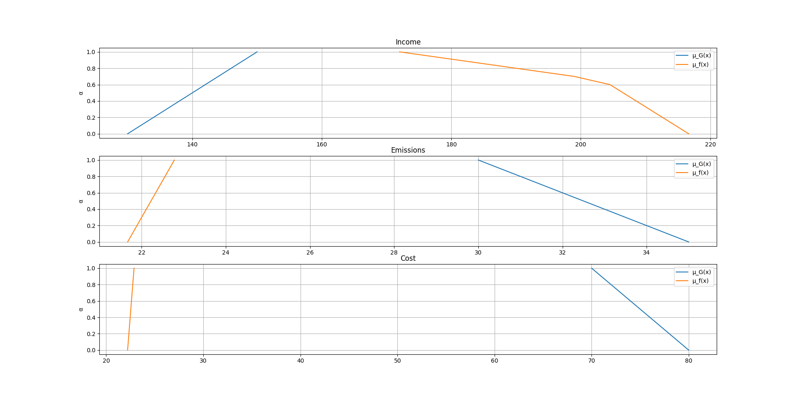
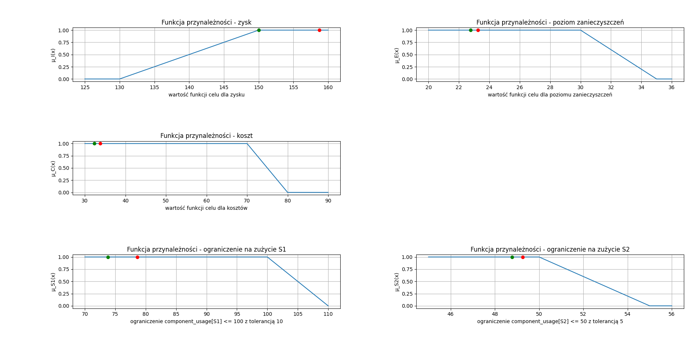

# Zadanie

### Zestaw 6_JG

## Opis modelowanego problemu:

Przedsiębiorstwo produkuje trzy produkty $P1$, $P2$, $P3$ (sztuki). Każdy z tych produktów potrzebuje trzech różnych składników $S1$, $S2$, $S3$ (kg/jednostkę). Każdy z produktów ma inną ceną jednostkową sprzedaży $C_{P1}$, $C_{P2}$, $C_{P3}$ (tyś.PLN/jednostkę). Firma zwraca uwagę na ekologię i szacuje jednostkowy poziom zanieczyszczeń emitowanych dla poszczególnych produktów $Z_{P1}$, $Z_{P2}$, $Z_{P3}$ (kg/jednostkę). Dostępne
są również jednostkowe koszty produkcji $K_{P1}$, $K_{P2}$, $K_{P3}$ (tyś.PLN/jednostkę).

Ograniczenia:

1. Nie można użyć więcej niż 110 kg składnika $S1$, ale 100 kg jest akceptowalne.
2. Zaleca się użycie 50 kg składnika $S2$, ale zużycie powyżej 55 kg nie jest akceptowalne.
3. Nie jest akceptowalne zużycie składnika $S3$ powyżej 50 kg.
4. Zakłada się się, że produkcja produktu $P1$ powinna być nie mniejsza niż 3 sztuki, a produktu $P3$ nie mniejsza niż 5 sztuk.

Cele postawione przez zarządzających firmą:

1. Maksymalizacja zysków; dążenie do zysku na poziomie 150 tyś. PLN, ale akceptowalny jest zysk na poziomie 130 tyś PLN.
2. Minimalizacja emisji zanieczyszczeń; dążenie do emisji na poziomie 30 kg, ale poziom 35 kg jest akceptowalny.
3. Minimalizacja kosztów produkcji; dążenie do kosztów na poziomie 70 tyś. PLN, ale koszty na poziomie 80 tyś. są akceptowalne.

### Polecenia do wykonania:

1. (2) Sformułować i opisać wielokryterialny model planowania produkcji z wykorzystaniem metody punktu odniesienia.
2. (3) Sformułować i opisać wielokryterialny model optymalnego planowania produkcji z wykorzystaniem zbiorów rozmytych.
3. (10) Sformułować równoważne zadanie optymalizacji dla zadania 2 z wykorzystaniem zbiorów rozmytych adaptując podejście Zimmermana dla więcej niż jednego kryterium.
4. (3) Zapisz zadanie/zadania sformułowane w punkcie 1 w postaci do rozwiązania z wykorzystaniem wybranego narzędzia implementacji (np. AMPL, AIMMS) i rozwiąż to zadanie/zadania. W przypadku niedopuszczalności zadania zaproponuj zmianę celów i/lub innych parametrów.
5. (7) Zapisz zadania sformułowane w punkcie 3 w postaci do rozwiązania z wykorzystaniem wybranego narzędzia implementacji (np. AMPL, AIMMS) i rozwiąż te zadania. W przypadku niedopuszczalności zadania zaproponuj zmianę celów i/lub innych parametrów.
6. (3) Porównaj rozwiązania zadań z poprzednich dwóch punktów.
7. (2) Rozwiąż zadanie z punktu 2 za pomoca pakietu R – FuzzyLP. Należy w obliczeniach rozpatrywać niezależnie każde z kryteriów.
8. (3) Zaproponuj i zastosuj graficzną formę analizy rozwiązań.
9. (2) Opisz zalety i wady modelowania opisanego problemu z wykorzystaniem zbiorów rozmytych.

### Dane:

produkt | S1 | S2 | S3 | Cx | Zx | Kx
--------|----|----|----|----|----|---
P1      | 2  | 8  | 4  | 9  | 1  | 1
P2      | 10 | 1  | 0  | 21 | 1  | 3
P3      | 4  | 4  | 2  | 11 | 3  | 3

produkt [sztuki] \\ składniki [kg/jednostkę] | S1 | S2 | S3
---------------------------------------------|----|----|---
P1                                           | 2  | 8  | 4
P2                                           | 10 | 1  | 0
P3                                           | 4  | 4  | 2

produkt [sztuki] \\ cena jednostkowa [tyś.PLN/jednostkę] | Cx
---------------------------------------------------------|---
P1                                                       | 9
P2                                                       | 21
P3                                                       | 11

produkt [sztuki] \\ emitowane zanieczyszczenia [kg/jednostkę] | Zx
--------------------------------------------------------------|---
P1                                                            | 1
P2                                                            | 1
P3                                                            | 3

produkt [sztuki] \\ koszty produkcji [tyś.PLN/jednostkę] | Kx
---------------------------------------------------------|---
P1                                                       | 1
P2                                                       | 3
P3                                                       | 3

\newpage

# Opracowany domyślny model

Został przygotowany bazowy model na bazie, który w zależności od podpunktu zadania został rozbudowany o dodatkowe zbiory, parametry, zmienne decyzyjne, ograniczenia i funkcje oceny.

## Zbiory

- $PRODUCTS = \{P1, P2, P3\}$ - zbiór możliwych do wyprodukowania produktów,
- $COMPONENTS = \{S1, S2, S3\}$ - zbiór składników, z których wytwarzane są produkty,
- $OBJECTIVES = \{S1, S2, income, emissions, cost\}$ - zbiór nazwanych zmiennych decyzyjnych, dla których ustalone są aspiracje. Tak zdefiniowany zbiór pozwala na uproszczenie zapisu niektórych ograniczeń,
- $MAX\_OBJECTIVES = \{income\}$ - dodatkowy zbiór zmiennych decyzyjnych, które należy maksymalizować,
- $MIN\_OBJECTIVES = \{S1, S2, emissions, cost\}$ - zbiór zmiennych decyzyjnych, które należy minimalizować.

## Parametry

- $PRODUCT\_INCOME[p],\ p \in PRODUCTS$ - jednostkowa cena sprzedaży produktów $p$ (tyś.PLN/jednostkę),

$PRODUCTS$ | $PRODUCT\_INCOME[p]$
-----------|---------------------
P1         | 9
P2         | 21
P3         | 11

- $EMITTED\_POLLUTANTS[p],\ p \in PRODUCTS$ - jednostkowy poziom zanieczyszczeń emitowanych dla poszczególnych produktów $p$ (kg/jednostkę),

$PRODUCTS$ | $EMITTED\_POLLUTANTS[p]$
-----------|-------------------------
P1         | 1
P2         | 1
P3         | 3

- $PRODUCTION\_COST[p],\ p \in PRODUCTS$ - jednostkowe koszty produkcji produktu $p$ (tyś.PLN/jednostkę),

$PRODUCTS$ | $PRODUCTION\_COST[p]$
-----------|----------------------
P1         | 1
P2         | 3
P3         | 3

- $PRODUCT\_COMPONENTS[p][c],\ p \in PRODUCTS,\ c \in COMPONENTS$ - wymagana ilość składnika $c$ do wytworzenia produktu $p$.

$PRODUCT\_COMPONENTS[p][c]$ | S1 | S2 | S3
----------------------------|----|----|---
P1                          | 2  | 8  | 4
P2                          | 10 | 1  | 0
P3                          | 4  | 4  | 2

Dodatkowe parametry wynikające z zadanych ograniczeń:

- $COMPONENT\_USAGE\_HARD\_LIMIT[c],\ c \in COMPONENTS$ - maksymalna ilość składnika $c$ jaką można wykorzystać,

$COMPONENTS$ | $COMPONENT\_USAGE\_HARD\_LIMIT[c]$
-------------|-----------------------------------
S1           | 110
S2           | 55
S3           | 50

- $MINIMAL\_PRODUCTION[p],\ p \in PRODUCTS$ - minimalna ilość sztuk produktu $p$ jaką należy wyprodukować,

$PRODUCTS$ | $MINIMAL\_PRODUCTION[p]$
-----------|-------------------------
P1         | 3
P2         | 0
P3         | 5


- $MIN\_INCOME = 130$ - minimalny akceptowalny poziom zarobków,
- $MAX\_EMISSIONS = 35$ - maksymalny akceptowalny poziom emisji zanieczyszczeń,
- $MAX\_COST = 80$ - maksymalny akceptowalny koszt wytwarzania wszystkich produktów.

Parametry wynikające z zadanych aspiracji:

- $ASPIRATIONS[o],\ o \in OBJECTIVES$ - aspiracje ustalone dla poszczególnych zmiennych decyzyjnych.

$OBJECTIVES$ | $ASPIRATIONS[o]$
-------------|-----------------
S1           | 100
S2           | 50
income       | 150
emissions    | 30
cost         | 70

## Zmienne decyzyjne

- $production[p],\ p \in PRODUCTS$ - zmienna reprezentująca ilość wyprodukowanych produktów typu $p$,
- $component\_usage[c],\ c \in COMPONENTS$ - reprezentuje całkowite wykorzystanie składnika typu $c$ do produkcji wszystkich produktów,
- $income$ - zmienna pomocnicza oznaczająca całkowity zysk ze sprzedaży produktów,
- $emissions$ - całkowite zanieczyszczenia wyemitowane podczas produkcji wszystkich produktów,
- $cost$ - sumaryczne koszty produkcji wyrobów.

W celu prostszego zapisu wzorów na zadane aspiracje został zdefiniowany dodatkowy wektor zmiennych decyzyjnych:

- $objectives[o],\ o \in OBJECTIVES$ - zmienna agregująca wartości kilku innych zmiennych decyzyjnych. W ramach tej zmiennej zostały także zdefiniowane odpowiednie ograniczenia:
$$
objectives[S1] = component\_usage[S1]
$$
$$
objectives[S2] = component\_usage[S2]
$$
$$
objectives[income] = income
$$
$$
objectives[emissions] = emissions
$$
$$
objectives[cost] = cost
$$

W celu prostszego zapisu wzorów na zadane nieakceptowalne poziomy został zdefiniowany dodatkowy wektor zmiennych decyzyjnych:

- $hard\_limits[o],\ o \in OBJECTIVES$ - zmienna agregująca wartości kilku innych parametrów. W ramach tej zmiennej zostały także zdefiniowane odpowiednie ograniczenia:
$$
hard\_limits[S1] = COMPONENT\_USAGE\_HARD\_LIMIT[S1];
$$
$$
hard\_limits[S2] = COMPONENT\_USAGE\_HARD\_LIMIT[S2];
$$
$$
hard\_limits[income] = MIN\_INCOME;
$$
$$
hard\_limits[emissions] = MAX\_EMISSIONS;
$$
$$
hard\_limits[cost] = MAX\_COST;
$$

## Ograniczenia

Ograniczenia wynikające z treści:

- Poszczególne składniki są wykorzystywane do produkcji różnych produktów w różnych proporcjach:
$$
\forall{c \in COMPONENTS}:
$$
$$
component\_usage[c] = \sum_{p \in PRODUCTS} PRODUCT\_COMPONENTS[p, c] \cdot production[p]
$$

- Na całkowity zysk składają się zarobki ze sprzedaży wyprodukowanych wyrobów pomniejszone o koszty produkcji:
$$
income = (\sum_{p \in PRODUCTS} PRODUCT\_INCOME[p] \cdot production[p]) - cost
$$

- Całkowity emisje są rezultatem zanieczyszczeń wytworzonych podczas produkcji poszczególnych produktów:
$$
emissions = \sum_{p \in PRODUCTS} EMITTED\_POLLUTANTS[p] \cdot production[p]
$$

- Całkowite koszty produkcji składają się z kosztów wytworzenia poszczególnych produktów:
$$
cost = \sum_{p \in PRODUCTS} PRODUCTION\_COST[p] \cdot production[p]
$$

Ograniczenia wynikające z zadanych ograniczeń:

- Zadane są limity wykorzystania poszczególnych składników, których przekroczenie jest nieakceptowalne:
$$
\forall{c \in COMPONENTS}: component\_usage[c] \le COMPONENT\_USAGE\_HARD\_LIMIT[c]
$$

- Narzucona jest minimalna produkcja poszczególnych produktów:
$$
\forall{p \in PRODUCTS}: production[p] \ge MINIMAL\_PRODUCTION[p]
$$

- Oczekujemy minimalnych zysków na poziomie $MIN\_INCOME$:
$$
income \ge MIN\_INCOME
$$

- Można wyprodukować maksymalnie $MAX\_EMISSIONS$ zanieczyszczeń:
$$
emissions \le MAX\_EMISSIONS
$$

- Koszty produkcji nie mogą przekroczyć $MAX\_COST$:
$$
cost \le MAX\_COST
$$

- Produkcja musi być liczbą nieujemną:
$$
\forall{p \in PRODUCTS}: production[p] \ge 0
$$

## Funkcja oceny

Funkcje oceny, które są optymalizowane będą zdefiniowane oddzielnie w zależności od rozwiązywanego podpunktu.

\newpage

# 1. Sformułować i opisać wielokryterialny model planowania produkcji z wykorzystaniem metody punktu odniesienia.

Model bazuje na przygotowanym modelu podstawowym. W tym rozdziale zostaną zdefiniowane jedynie dodatkowe parametry, ograniczenia, i zmienne decyzyjne. Zostały one zdefiniowane, by wykorzystać metodę punktu odniesienia.

## Zbiory

- $RANGE = \{utopia, nadir\}$ - zbiór pozwalający na ustalenie zakresu dla zmiennych celu.

## Parametry

- $\beta = 10^{-3}$ - parametr pozwalający na ograniczenie wzrostu wartości funkcji oceny dla zmiennych decyzyjnych ponad zadany poziom aspiracji. Funkcja oceny dla parametrów, które ten poziom osiągnęły będzie rosła o $\beta$ wolniej, niż dla tych zmiennych, które tego poziomu nie osiągnęły,
- $\varepsilon  = 10^{-4} / 5 = 2 \cdot 10^{-5}$ - parametr z wagą jaką będziemy przyjmować dla sumy zmiennych celu. Zapewnia on, że każde otrzymane rozwiązanie będzie efektywne,
- $OBJECTIVE\_RANGE[o][r],\ o \in OBJECTIVES,\ r \in RANGE$ - wyliczone na podstawie bazowego modelu dla każdej zmiennej celu wartości utopii i nadiru:

$OBJECTIVE\_RANGE[o][r]$ | utopia  | nadir
-------------------------|---------|--------
S1                       | 60.2941 | 110
S2                       | 47.6667 | 55
income                   | 216.667 | 130
emissions                | 21.6667 | 28.2778
cost                     | 28.6765 | 44.5

## Zmienne decyzyjne

- $\lambda[o],\ o \in OBJECTIVES$ - parametry normalizujące zakres zmienności kryteriów. Wyliczone na bazie wartości utopii i nadiru dla poszczególnych celów $o$,
- $accomplishment[o],\ o \in OBJECTIVES$ - wyznaczony poziom zadowolenia z osiągnięcia poszczególnych wartości zmiennych celu $o$,
- $lower\_bound$ - dolne ograniczenie wszystkich poziomów zadowolenia z osiągnięcia aspiracji.

## Ograniczenia

- Wyliczamy parametr normalizujący $\lambda$ na bazie wartości utopii i nadiru:
$$
\lambda[o] = 1 / (OBJECTIVE\_RANGE[o][utopia] - OBJECTIVE\_RANGE[o][nadir])
$$

- Wprowadzamy zmienną $lower\_bound$, która będzie mniejsza niż każde z poziomów zadowolenia:
$$
\forall{o \in OBJECTIVES}: lower\_bound \le accomplishment[o]
$$

- Poziom zadowolenia dla wartości przekraczających aspirację będzie pomniejszony o $\beta$:
$$
\forall{o \in OBJECTIVES}: accomplishment[o] \le \beta \cdot \lambda[o] \cdot (objectives[o] - ASPIRATIONS[o])
$$

- Poziom zadowolenia będzie rósł liniowo zgodnie z wartościami celu, do osiągnięcia poziomu aspiracji:
$$
\forall{o \in OBJECTIVES}: accomplishment[o] \le \lambda[o] \cdot (objectives[o] - ASPIRATIONS[o])
$$

## Funkcja oceny

- W pierwszej kolejności maksymalizujemy najmniejszy poziom zadowolenia, a z mniejszą wagą maksymalizujemy całkowite zadowolenie:
$$
max(lower\_bound + \varepsilon  \cdot \sum_{o \in OBJECTIVES} accomplishment[o])
$$

\newpage

# 2. Sformułować i opisać wielokryterialny model optymalnego planowania produkcji z wykorzystaniem zbiorów rozmytych.

Model bazuje na przygotowanym modelu podstawowym. W tym rozdziale zostaną zdefiniowane jedynie dodatkowe parametry, ograniczenia, ograniczenia rozmyte, zmienne decyzyjne i cele rozmyte. Zostały one zdefiniowane, by wykorzystać metodę zbiorów rozmytych.

## Zmienne decyzyjne

- $tolerance[o], o \in OBJECTIVES$ - zmienna reprezentująca rozmycie ograniczeń (wartość stała). Zostało przyjęte, że dla zmiennych z górnym nieakceptowalnym ograniczeniem wartość jest dodatnia, a z dolnym ograniczeniem wartość ujemna.

## Ograniczenia

- Przyjęty poziom tolerancji możemy osiągnąć poprzez odjęcie od ustalonych nieprzekraczalnych limitów naszych aspiracji:
$$
\forall{o \in OBJECTIVES}: tolerance[o] = hard\_limits[o] - ASPIRATIONS[o]
$$

## Ograniczenia rozmyte

- Nie powinniśmy wykorzystać więcej składnika $S1$ niż zadany poziom aspiracji z poziomem tolerancji równym $|tolerance[S1]|$:
$$
component\_usage[S1] \underset{\sim}{\le} ASPIRATIONS[S1]
$$

- Nie powinniśmy wykorzystać więcej składnika $S2$ niż zadany poziom aspiracji z poziomem tolerancji równym $|tolerance[S2]|$:
$$
component\_usage[S2] \underset{\sim}{\le} ASPIRATIONS[S2]
$$

## Cele rozmyte

- Celujemy by zysk przekroczył poziom aspiracji z poziomem tolerancji równym $|tolerance[income]|$:
$$
income \underset{\sim}{\le} ASPIRATIONS[income]
$$

- Celujemy by emisja zanieczyszczeń była mniejsza niż zadany poziom aspiracji z poziomem tolerancji równym $|tolerance[emissions]|$:
$$
emissions \underset{\sim}{\le} ASPIRATIONS[emissions]
$$

- Celujemy by całkowite koszty były mniejsze niż zadany poziom aspiracji z poziomem tolerancji równym $|tolerance[cost]|$:
$$
cost \underset{\sim}{\le} ASPIRATIONS[cost]
$$

\newpage

# 3. Sformułować równoważne zadanie optymalizacji dla zadania 2 z wykorzystaniem zbiorów rozmytych adaptując podejście Zimmermana dla więcej niż jednego kryterium.

Model bazuje na przygotowanym modelu podstawowym. W tym rozdziale zostaną zdefiniowane jedynie dodatkowe parametry, ograniczenia, zmienne decyzyjne i funkcje oceny. Zostały one zdefiniowane, by wykorzystać metodę zbiorów rozmytych z podejściem Zimmermana dla więcej niż jednego kryterium.

## Zmienne decyzyjne

- $\alpha$ - zmienna decyzyjna dla $\alpha$-przekrojów,

- $tolerance[o], o \in OBJECTIVES$ - zmienna reprezentująca rozmycie ograniczeń (wartość stała). Zostało przyjęte, że dla zmiennych z górnym nieakceptowalnym ograniczeniem wartość jest dodatnia, a z dolnym ograniczeniem wartość ujemna.

## Ograniczenia

- Zmienna $\alpha$ może przyjmować wartości z zakresu [0; 1]. Warto tutaj zwrócić uwagę, że przez narzucone górne ograniczenie na wartość $\alpha$ w efekcie możemy otrzymać rozwiązanie, które nie będzie najlepszym jeśli byśmy brali pod uwagę także inne kryteria:
$$
0 \le \alpha \le 1
$$

- Przyjęty poziom tolerancji możemy osiągnąć poprzez odjęcie od ustalonych nieprzekraczalnych limitów naszych aspiracji:
$$
\forall{o \in OBJECTIVES}: tolerance[o] = hard\_limits[o] - ASPIRATIONS[o]
$$

Definiujemy rozmyte ograniczenia:

- Ograniczenia dla celów, które maksymalizujemy (znak dla $tolerance[o]$ zależy od przyjętych założeń):
$$
\forall{o \in MAX\_OBJECTIVES}:
$$
$$
objectives[o] \ge ASPIRATIONS[o] + tolerance[o] \cdot (1 - \alpha)
$$

- Ograniczenia dla celów, które minimalizujemy (znak dla $tolerance[o]$ zależy od przyjętych założeń):
$$
\forall{o \in MIN\_OBJECTIVES}:
$$
$$
objectives[o] \le ASPIRATIONS[o] + tolerance[o] \cdot (1 - \alpha)
$$

\newpage

# Przygotowany bazowy model

W celu minimalizacji ilości kopiowanego kodu został przygotowany model bazowy, który następnie został wykorzystany w obu przygotowanych modelach.

Plik zawierający zdefiniowane parametry - parameters.dat:

```py
data;

set PRODUCTS := P1 P2 P3;
set COMPONENTS := S1 S2 S3;
set OBJECTIVES := S1 S2 income emissions cost;
set MAX_OBJECTIVES := income;
set MIN_OBJECTIVES := S1 S2 emissions cost;

param PRODUCT_INCOME :=
	P1   9,
	P2   21,
	P3   11;

param EMITTED_POLLUTANTS :=
	P1	1,
	P2  1,
	P3  3;

param PRODUCTION_COST :=
	P1	1,
	P2	3,
	P3	3;

param PRODUCT_COMPONENTS 
	:	S1	S2	S3	:=
	P1  2   8   4
	P2  10  1   0
	P3  4   4   2	;

param COMPONENT_USAGE_HARD_LIMIT :=
	S1	110,
	S2	55,
	S3	50;

param MINIMAL_PRODUCTION :=
	P1	3,
	P2	0,
	P3	5;

param MIN_INCOME := 130;
param MAX_EMISSIONS := 35;
param MAX_COST := 80;

param ASPIRATIONS :=
	S1			100,
	S2			50,
	income		150,
	emissions	30,
	cost		70;

end;
```

Bazowy plik z modelem - task.mod:

```py
set PRODUCTS;
set COMPONENTS;
set OBJECTIVES;
set MAX_OBJECTIVES;
set MIN_OBJECTIVES;

param PRODUCT_INCOME{p in PRODUCTS};
param EMITTED_POLLUTANTS{p in PRODUCTS};
param PRODUCTION_COST{p in PRODUCTS};
param PRODUCT_COMPONENTS{p in PRODUCTS, c in COMPONENTS};

param COMPONENT_USAGE_HARD_LIMIT{c in COMPONENTS};
param MINIMAL_PRODUCTION{p in PRODUCTS};

param MIN_INCOME;
param MAX_EMISSIONS;
param MAX_COST;

param ASPIRATIONS{o in OBJECTIVES};

#############################################################################

var production{p in PRODUCTS} >= 0;

var component_usage{c in COMPONENTS};

var income;

var emissions;

var cost;

#############################################################################

var objectives{o in OBJECTIVES};
s.t. objectives_1: objectives['S1'] = component_usage['S1'];
s.t. objectives_2: objectives['S2'] = component_usage['S2'];
s.t. objectives_3: objectives['income'] = income;
s.t. objectives_4: objectives['emissions'] = emissions;
s.t. objectives_5: objectives['cost'] = cost;

#############################################################################

var hard_limits{o in OBJECTIVES};
s.t. hard_limits_1: hard_limits['S1'] = COMPONENT_USAGE_HARD_LIMIT['S1'];
s.t. hard_limits_2: hard_limits['S2'] = COMPONENT_USAGE_HARD_LIMIT['S2'];
s.t. hard_limits_3: hard_limits['income'] = MIN_INCOME;
s.t. hard_limits_4: hard_limits['emissions'] = MAX_EMISSIONS;
s.t. hard_limits_5: hard_limits['cost'] = MAX_COST;

#############################################################################

subject to component_usage_constraint{c in COMPONENTS}:
	component_usage[c] = sum{p in PRODUCTS} PRODUCT_COMPONENTS[p, c] * production[p];

subject to income_constraint:
	income = (sum{p in PRODUCTS} PRODUCT_INCOME[p] * production[p]) - cost;

subject to emissions_constraint:
	emissions = sum{p in PRODUCTS} EMITTED_POLLUTANTS[p] * production[p];
	
subject to cost_constraint:
	cost = sum{p in PRODUCTS} PRODUCTION_COST[p] * production[p];

#############################################################################

subject to component_usage_hard_limit_constraint{c in COMPONENTS}:
	component_usage[c] <= COMPONENT_USAGE_HARD_LIMIT[c];
	
subject to minimal_production_constraint{p in PRODUCTS}:
	production[p] >= MINIMAL_PRODUCTION[p];

#############################################################################

subject to min_income_constraint:
	income >= MIN_INCOME;

subject to max_emissions_constraint:
	emissions <= MAX_EMISSIONS;

subject to max_cost_constraint:
	cost <= MAX_COST;
```

\newpage

# 4. Zapisz zadanie/zadania sformułowane w punkcie 1 w postaci do rozwiązania z wykorzystaniem wybranego narzędzia implementacji (np. AMPL, AIMMS) i rozwiąż to zadanie/zadania. W przypadku niedopuszczalności zadania zaproponuj zmianę celów i/lub innych parametrów.

Przygotowany model jest rozszerzeniem modelu bazowego opisanego w rozdziale poprzednim.

Dodatkowo zostały zdefiniowane kolejne zbiory i parametry - 1-parameters.dat:

```py
data;

set RANGE := utopia nadir;

param BETA := 1e-3;
param EPSILON := 2e-5;

param OBJECTIVE_RANGE
	:			utopia		nadir	:=
	S1			60.2941     110
	S2			47.6667     55
	income		216.667     130
	emissions	21.6667     28.2778
	cost		28.6765     44.5    ;

end;
```

Następnie zmienne decyzyjne, ograniczenia i funkcje oceny zostały zdefiniowane w skrypcie do uruchomienia - 1-task.run:

```py
reset;

option solver cplex;
option cplex_options "time=180";

model task.mod;
data parameters.dat;

#############################################################################

set RANGE;

param BETA;
param EPSILON;

param OBJECTIVE_RANGE{o in OBJECTIVES, r in RANGE};

data 1-parameters.dat;

#############################################################################

var lambda{o in OBJECTIVES};

var accomplishment{o in OBJECTIVES};

var lower_bound;

#############################################################################

subject to lambda_calculation_constraint{o in OBJECTIVES}:
	lambda[o] = 1 / (OBJECTIVE_RANGE[o, 'utopia'] - OBJECTIVE_RANGE[o, 'nadir']);
	
subject to lower_bound_constraint{o in OBJECTIVES}:
	lower_bound <= accomplishment[o];

subject to accomplishment_achieved_constraint{o in OBJECTIVES}:
	accomplishment[o] <= BETA * lambda[o] * (objectives[o] - ASPIRATIONS[o]);

subject to accomplishment_constraint{o in OBJECTIVES}:
	accomplishment[o] <= lambda[o] * (objectives[o] - ASPIRATIONS[o]);

#############################################################################

maximize max_constraint:
	lower_bound + EPSILON * sum{o in OBJECTIVES} accomplishment[o];

#############################################################################

solve;

#############################################################################

display income;
display emissions;
display cost;
display production;
display component_usage;
display lambda;
```

## Wyniki

Zysk (tyś.PLN) | Poziom emisji (kg) | Koszty (tys.PLN)
---------------|--------------------|-----------------
158.72         | 23.2622            | 33.7866

Produkt | Ilość wytworzonych sztuk
--------|-------------------------
P1      | 3
P2      | 5.2622
P3      | 5

Materiał | Wykorzystanie (kg)
---------|-------------------
S1       | 78.622
S2       | 49.2622
S3       | 22

Wszystkie ograniczenia zostały spełnione, a także wszystkie aspiracje zostały osiągnięte.

\newpage

# 5. Zapisz zadania sformułowane w punkcie 3 w postaci do rozwiązania z wykorzystaniem wybranego narzędzia implementacji (np. AMPL, AIMMS) i rozwiąż te zadania. W przypadku niedopuszczalności zadania zaproponuj zmianę celów i/lub innych parametrów.

Przygotowany model jest rozszerzeniem modelu bazowego opisanego w jednym z poprzednich rozdziałów.

W pliku 3-task.run zostały zdefiniowane dodatkowe zmienne decyzyjne, ograniczenia i funkcje oceny:

```py
reset;

option solver cplex;
option cplex_options "time=180";

model task.mod;
data parameters.dat;

#############################################################################

var alpha >= 0;
s.t. alpha_constraint: alpha <= 1;

var tolerance{o in OBJECTIVES};

#############################################################################

subject to tolerance_constraint{o in OBJECTIVES}:
	tolerance[o] = hard_limits[o] - ASPIRATIONS[o];

subject to zimmerman_greater_constraint{o in MAX_OBJECTIVES}:
	objectives[o] >= ASPIRATIONS[o] + tolerance[o] * (1 - alpha);

subject to zimmerman_lower_constraint{o in MIN_OBJECTIVES}:
	objectives[o] <= ASPIRATIONS[o] + tolerance[o] * (1 - alpha);

#############################################################################

maximize max_constraint:
	alpha;

#############################################################################

solve;

#############################################################################

display income;
display emissions;
display cost;
display production;
display component_usage;
display alpha;
display tolerance;
```

## Wyniki

Zysk (tyś.PLN) | Poziom emisji (kg) | Koszty (tys.PLN)
---------------|--------------------|-----------------
150            | 22.7778            | 32.3333

Produkt | Ilość wytworzonych sztuk
--------|-------------------------
P1      | 3
P2      | 4.77778
P3      | 5

Materiał | Wykorzystanie (kg)
---------|-------------------
S1       | 73.7778
S2       | 48.7778
S3       | 22

Wszystkie ograniczenia zostały spełnione, a także wszystkie aspiracje zostały osiągnięte.

\newpage

# 6. Porównaj rozwiązania zadań z poprzednich dwóch punktów.

Model                                  | Zysk (tyś.PLN) | Poziom emisji (kg) | Koszty (tys.PLN)
---------------------------------------|----------------|--------------------|-----------------
metoda punktu odniesienia              | 158.72         | 23.2622            | 33.7866
zbiory rozmyte z podejściem Zimmermana | 150            | 22.7778            | 32.3333

Produkt | metoda punktu odniesienia | zbiory rozmyte z podejściem Zimmermana
--------|---------------------------|---------------------------------------
P1      | 3                         | 3
P2      | 5.2622                    | 4.77778
P3      | 5                         | 5

Materiał | metoda punktu odniesienia | zbiory rozmyte z podejściem Zimmermana
---------|---------------------------|---------------------------------------
S1       | 78.622                    | 73.7778
S2       | 49.2622                   | 48.7778
S3       | 22                        | 22

Uzyskane wyniki są bardzo pozytywne. Wszystkie aspiracje zostały spełnione.

Metoda punktu odniesienia uzyskała rozwiązanie, które jest lepsze pod względem kosztów od rozwiązania otrzymanego za pomocą zbiorów rozmytych z podejściem Zimmermana.

Zostało zauważone, że w przypadku podejścia Zimmermana ograniczenie $\alpha \le 1$ mogło prowadzić do rozwiązania, które spełnia wszystkie aspiracje, ale mogłoby być zdominowane przez inne lepsze rozwiązanie. Dla podanych parametrów, po usunięciu tego górnego ograniczenia maksymalna osiągnięta wartość zmiennej $\alpha$ jaką udało się uzyskać to 1.2. Tak uzyskane rozwiązanie jest bardziej zrównoważone względem obu podejść:

Model                                                     | Zysk (tyś.PLN) | Poziom emisji (kg) | Koszty (tys.PLN)
----------------------------------------------------------|----------------|--------------------|-----------------
podejście Zimmermana bez górnego ograniczenia na $\alpha$ | 154            | 23                 | 33

Rozwiązanie prowadzi do większych zysków, jednak jest gorsze od poprzedniego rozwiązania pod względem kosztów i poziomu emisji.

\newpage

# 7. Rozwiąż zadanie z punktu 2 za pomoca pakietu R – FuzzyLP. Należy w obliczeniach rozpatrywać niezależnie każde z kryteriów.

Zadanie z punktu drugiego zostało rozwiązane za pomocą pakietu R z wykorzystaniem biblioteki FuzzyLP:

```r
library(FuzzyLP)

constraints <- matrix(
    c(
    #   P1  P2  P3
        2,  10, 4, # S1 <= 100 tolerance 10  
        8,  1,  4, # S2 <= 50 tolerance 5
        4,  0,  2, # S3 <= 50 tolerance 0
        1,  0,  0, # P1 >= 3 tolerance 0
        0,  0,  1, # P3 >= 5 tolerance 0
        9,  19, 9, # income >= 150 tolerance 20
        1,  1,  3, # emissions <= 30 tolerance 5
        1,  3,  3  # cost <= 70 tolerance 10
    ),
    nrow = 8, 
    byrow = TRUE
)
directions <- c("<=", "<=", "<=", ">=", ">=", ">=", "<=", "<=")
aspiration <- c(100,  50,   50,   3,    5,    150,  30,   70)
tolerance  <- c(10,   5,    0,    0,    0,    20,   5,    10)

calculate <- function(objective, target, target_tolerance, maximum) {
    result <- FCLP.fuzzyObjective(
        objective, 
        constraints, 
        directions, 
        aspiration, 
        tolerance, 
        z0=target,
        t0=target_tolerance, 
        maximum=maximum, 
        verbose=TRUE
    )
    return(result)
}

show_results <- function(result, name) {
    income    <- sum(objective_income * result[, c("x1", "x2", "x3")])
    emissions <- sum(objective_emissions * result[, c("x1", "x2", "x3")])
    cost      <- sum(objective_cost * result[, c("x1", "x2", "x3")])

    S1_component_usage <- 2 * result[, "x1"] + 10 * result[, "x2"] + 4 * result[, "x3"]
    S2_component_usage <- 8 * result[, "x1"] + 1  * result[, "x2"] + 4 * result[, "x3"]
    S3_component_usage <- 4 * result[, "x1"] + 0  * result[, "x2"] + 2 * result[, "x3"]
    
    cat("objective =", name, "\n")
    cat("income =", income, "\n")
    cat("emissions =", emissions, "\n")
    cat("cost =", cost, "\n")
    cat("S1_component_usage =", S1_component_usage, "\n")
    cat("S2_component_usage =", S2_component_usage, "\n")
    cat("S3_component_usage =", S3_component_usage, "\n\n")
}

objective_income <- c(9, 19, 9)
objective_emissions <- c(1, 1, 3)
objective_cost <- c(1, 3, 3)

cat("\nResults:\n\n")

result <- calculate(objective_income, 150, 20, TRUE)
show_results(result, "income")

result <- calculate(objective_emissions, 30, 5, FALSE)
show_results(result, "emissions")

result <- calculate(objective_cost, 70, 10, FALSE)
show_results(result, "cost")
```

W rezultacie wywołania programu otrzymujemy następujące wyniki:

```
Results:

Bound reached, FCLP.fixedBeta with beta = 1 may obtain better results.
objective = income 
income = 150 
emissions = 22.10526 
cost = 30.31579 
S1_component_usage = 67.05263 
S2_component_usage = 48.10526 
S3_component_usage = 22 

Bound reached, FCLP.fixedBeta with beta = 1 may obtain better results.
objective = emissions 
income = 150 
emissions = 22.10526 
cost = 30.31579 
S1_component_usage = 67.05263 
S2_component_usage = 48.10526 
S3_component_usage = 22 

Bound reached, FCLP.fixedBeta with beta = 1 may obtain better results.
objective = cost 
income = 150 
emissions = 22.10526 
cost = 30.31579 
S1_component_usage = 67.05263 
S2_component_usage = 48.10526 
S3_component_usage = 22
```

Otrzymane wyniki podobnie jak w poprzednich zadaniach spełniają ograniczenia oraz wszystkie aspiracje.

Model                                                     | Zysk (tyś.PLN) | Poziom emisji (kg) | Koszty (tys.PLN)
----------------------------------------------------------|----------------|--------------------|-----------------
metoda punktu odniesienia                                 | 158.72         | 23.2622            | 33.7866
zbiory rozmyte z podejściem Zimmermana                    | 150            | 22.7778            | 32.3333
podejście Zimmermana bez górnego ograniczenia na $\alpha$ | 154            | 23                 | 33
zbiory rozmyte z biblioteką FuzzyLP                       | 150            | 22.10526           | 30.31579

Okazuje się, że rozwiązanie otrzymane z wykorzystaniem podejścia Zimmermana prowadzi do rezultatu, który jest zdominowany przez rozwiązanie otrzymane biblioteką FuzzyLP. Najprawdopodobniej wynika to z faktu, że podejście Zimmermana może zwrócić dowolne rozwiązanie, które spełnia wszystkie aspiracje (takie, dla którego $\alpha = 1$).

\newpage

# 8. Zaproponuj i zastosuj graficzną formę analizy rozwiązań.

Wyniki dla metody Zimmermana wyznaczane poprzez ustalenie poziomu alpha zostały zaprezentowane na wykresie:



W ramach graficznej analizy rozwiązania została dodatkowo przygotowana seria wykresów zawierających funkcje przynależności dla poszczególnych celów. Rozwiązania z obu modeli zostały oznaczone czerwonym kolorem (metoda punktu odniesienia) i zielonym kolorem (podejście Zimmermana).



\newpage

# 9. Opisz zalety i wady modelowania opisanego problemu z wykorzystaniem zbiorów rozmytych.

## Zalety

1. Umożliwienie uwzględnienia niepewności i nieprecyzyjności - przykładowo, zamiast sztywnego ograniczenia na poziom zanieczyszczeń, można zastosować rozmyte ograniczenie, które lepiej odzwierciedla rzeczywiste warunki produkcyjne.
2. Elastyczność w formułowaniu ograniczeń - na przykład, zamiast ustalać sztywne limity zużycia składników, można zdefiniować preferowane zakresy.
3. Lepsze odwzorowanie preferencji decydentów - zbiory rozmyte umożliwiają lepsze odwzorowanie subiektywnych preferencji i celów decydentów.
4. Zwiększenie tolerancji na zmienność danych - dzięki rozmytym ograniczeniom i celom, model staje się bardziej odporny na zmienność danych wejściowych. Nawet jeśli dokładne wartości kosztów, zysków czy emisji są trudne do przewidzenia, modelowanie rozmyte pozwala na uwzględnienie tej zmienności bez utraty dokładności wyników.

## Wady

1. Złożoność modelu - modele z ograniczeniami rozmytymi są bardziej skomplikowane niż te bazujące na klasycznych ograniczeniach.
2. Trudności w interpretacji wyników.
3. Subiektywność w definiowaniu funkcji przynależności - proces definiowania funkcji przynależności może być subiektywny i zależeć od wiedzy oraz doświadczenia osoby modelującej.
4. Wyniki modelu z ograniczeniami rozmytymi może mieć wyniki obarczone większą niepewnością.
5. Każde rozwiązanie spełniające aspiracje jest traktowane jednakowo.
